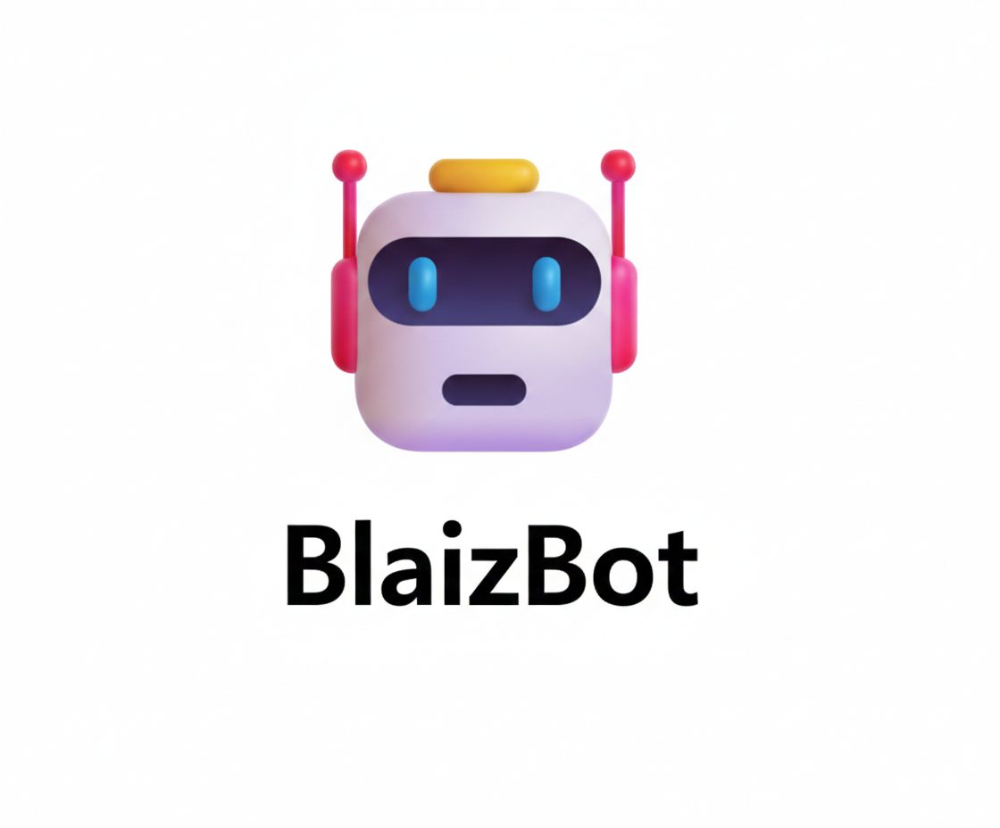
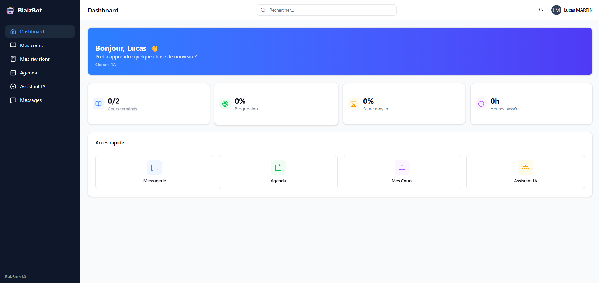

# Page de garde

  

---

## BlaizBot — Développement assisté par IA

### Travail de maturité

**Auteur** : Maxime Buirette  
**Établissement** : [lycée Blaise Cendrars]  
**Classe** : [3L]  

**Année scolaire** : 2025-2026

---

### Résumé du projet

Ce travail de maturité explore le **vibe coding**, une nouvelle approche du développement logiciel assistée par intelligence artificielle. À travers la réalisation de **BlaizBot**, une application web éducative full-stack, ce projet démontre comment un développeur peut collaborer efficacement avec des modèles de langage (LLM) pour concevoir, prototyper et déployer une application complète.

  

*Figure : Aperçu de l'application BlaizBot*

**Mots-clés** : Vibe Coding, Intelligence Artificielle, Développement Web, Next.js, Application Éducative, LLM, Prompt Engineering

---

**Date de remise** : [À compléter]  
**Nombre de pages** : [À compléter après finalisation]

---

> Ce document constitue la version finale du travail de maturité de Maxime Buirette, présentant la méthodologie, la réalisation et l'analyse d'un projet de développement assisté par IA dans un contexte académique.
