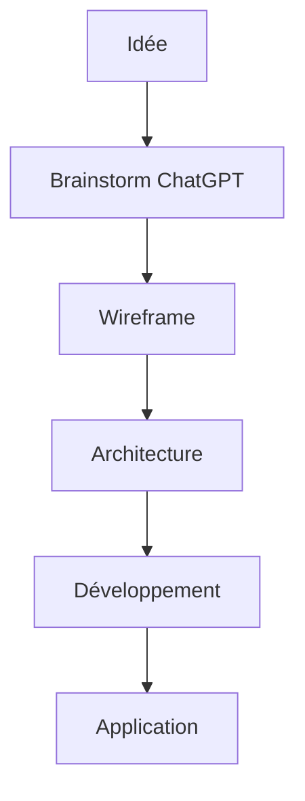

# 📸 Guide de Captures d'Écran pour l'Exposé BlaizBot

Ce guide liste toutes les captures d'écran nécessaires pour rendre l'exposé visuellement attractif.

## 🎯 Objectif

**50 pages ≈ 25-30 visuels** (1 visuel toutes les 2 pages en moyenne)

---

## 📋 Checklist des Captures par Chapitre

### Chapitre 01 - Introduction
- [ ] `01-intro-github-copilot-demo.png` - Interface GitHub Copilot dans VSCode
- [ ] `01-intro-chatgpt-interface.png` - Interface ChatGPT

### Chapitre 06 - Phase Brainstorming
- [ ] `06-brainstorm-chatgpt-nouveau-projet.png` - Création d'un projet ChatGPT
- [ ] `06-brainstorm-chatgpt-instructions.png` - Configuration du prompt système
- [ ] `06-brainstorm-chatgpt-session.png` - Exemple de session de brainstorming
- [ ] `06-brainstorm-chatgpt-documentation.png` - Documents uploadés dans le projet

### Chapitre 07 - Phase Wireframe
- [ ] `07-wireframe-dashboard-teacher.png` - Dashboard enseignant complet
- [ ] `07-wireframe-dashboard-student.png` - Dashboard élève complet
- [ ] `07-wireframe-dashboard-admin.png` - Dashboard admin complet
- [ ] `07-wireframe-calendrier.png` - Calendrier interactif en détail
- [ ] `07-wireframe-chatbot.png` - Interface chatbot Blaiz'bot
- [ ] `07-wireframe-code-structure.png` - Structure des fichiers dans VSCode

### Chapitre 08 - Phase Architecture
- [ ] `08-archi-vscode-agents.png` - Dossier agents dans VSCode
- [ ] `08-archi-copilot-chat.png` - Utilisation d'un agent dans Copilot Chat
- [ ] `08-archi-docs-structure.png` - Structure des docs techniques
- [ ] `08-archi-nextjs-structure.png` - Structure Next.js créée

### Chapitre 09 - Phase Développement
- [ ] `09-dev-component-creation.png` - Création d'un composant avec IA
- [ ] `09-dev-api-route.png` - Création d'une route API
- [ ] `09-dev-prisma-schema.png` - Schéma Prisma dans VSCode
- [ ] `09-dev-terminal-commands.png` - Commandes terminal typiques

### Chapitre 10 - Collaboration IA
- [ ] `10-collab-prompt-example.png` - Exemple de prompt efficace
- [ ] `10-collab-code-generated.png` - Code généré par l'IA
- [ ] `10-collab-correction-humain.png` - Correction humaine du code IA
- [ ] `10-collab-chat-history.png` - Historique de conversation Copilot

### Chapitre 11 - Résultats
- [ ] `11-results-app-finale.png` - Application finale en fonctionnement
- [ ] `11-results-metrics-dashboard.png` - Tableau de bord métriques

---

## 🖼️ Diagrammes à Créer

### Architecture
- [ ] `diag-architecture-globale.png` - Vue d'ensemble 4 repos
- [ ] `diag-workflow-vibecoding.png` - Les 5 phases du workflow
- [ ] `diag-collaboration-humain-ia.png` - Répartition des rôles

### Flux de Données
- [ ] `diag-flux-api-layer.png` - Pattern API Layer (mock/prod)
- [ ] `diag-nextjs-architecture.png` - Architecture Next.js App Router

### Graphiques
- [ ] `graph-temps-dev-comparaison.png` - Traditionnel vs Vibecoding
- [ ] `graph-repartition-taches.png` - Humain vs IA (camembert)
- [ ] `graph-evolution-projet.png` - Timeline du projet

---

## 📐 Spécifications Techniques

### Résolution
- **Captures d'écran** : 1920x1080 (Full HD) ou 2560x1440
- **Diagrammes** : Export SVG ou PNG 300 DPI
- **Format** : PNG (préféré) ou JPG (pour photos)

### Style
- **Mode** : Light mode préféré (meilleure lisibilité imprimée)
- **Annotations** : Flèches rouges pour points importants
- **Bordure** : Ombre légère ou bordure fine grise

### Outils Recommandés
- **Captures** : ShareX, Greenshot, ou outil Windows intégré
- **Annotations** : Paint.NET, Photoshop, ou Figma
- **Diagrammes** : Draw.io, Mermaid, ou Excalidraw
- **Graphiques** : Excel, Google Sheets, ou Chart.js

---

## 📁 Organisation des Fichiers

```
BlaizBot-projet/assets/
├── screenshots/
│   ├── 01-intro/
│   │   └── *.png
│   ├── 06-brainstorm/
│   │   └── *.png
│   ├── 07-wireframe/
│   │   └── *.png
│   ├── 08-archi/
│   │   └── *.png
│   ├── 09-dev/
│   │   └── *.png
│   ├── 10-collab/
│   │   └── *.png
│   └── 11-results/
│       └── *.png
├── diagrams/
│   └── *.png
└── figures/
    └── *.png
```

---

## ✅ Workflow de Capture

### Quand capturer ?
1. **Avant de commencer** une phase → État initial
2. **Pendant** le travail → Processus en cours
3. **Après validation** → Résultat final

### Process
1. Prendre la capture en résolution maximale
2. Renommer selon convention (`XX-section-description.png`)
3. Annoter si nécessaire (flèches, encadrés)
4. Placer dans le bon sous-dossier
5. Référencer dans le chapitre Markdown

### Exemple de référence dans Markdown
```markdown

*Figure 6.1 : Création d'un nouveau projet dans ChatGPT avec upload de documentation*
```

---

## 🎨 Templates de Diagrammes

### Mermaid (pour diagrammes simples)


### Draw.io (pour diagrammes complexes)
- Exporter en PNG 300 DPI
- Fond blanc (pas transparent)
- Police lisible (min 12pt)

---

## 📊 Captures Prioritaires (À faire en premier)

### Phase actuelle : Architecture
1. [ ] `06-brainstorm-chatgpt-session.png` - Session brainstorming
2. [ ] `07-wireframe-dashboard-teacher.png` - Dashboard principal
3. [ ] `08-archi-vscode-agents.png` - Structure agents

Ces 3 captures permettent d'illustrer les chapitres déjà rédigés.

---

**Dernière mise à jour** : 22 décembre 2025
