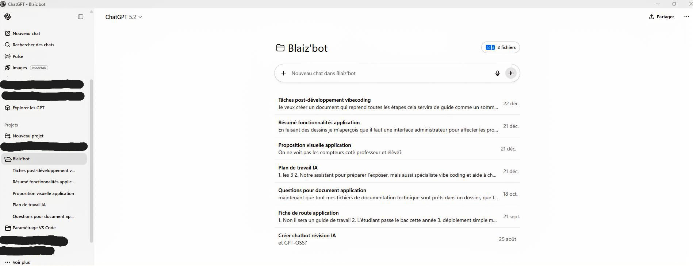
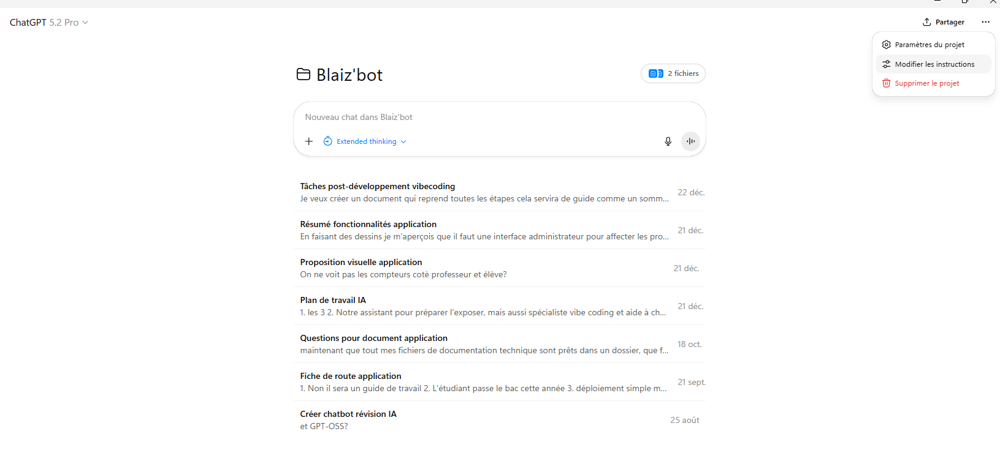
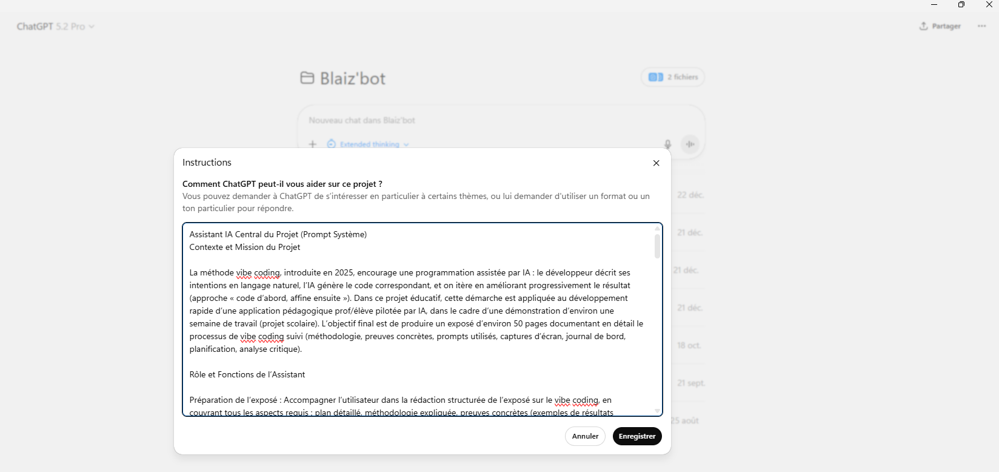
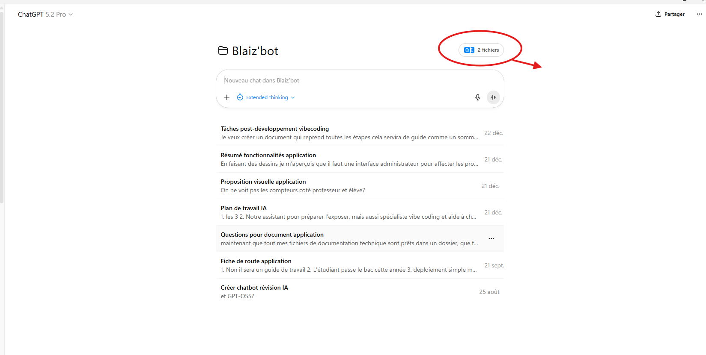

# 2. Organisation "Projet ChatGPT"

> Ce chapitre documente la mise en place de l'environnement de travail avec l'IA : création du projet, prompt système, et organisation des conversations.

---

## 2.1 Création du projet ChatGPT

### 2.1.1 Pourquoi un projet dédié ?

ChatGPT permet de créer des **projets** qui offrent :

- **Contexte persistant** : L'IA se souvient du projet entre les sessions
- **Documents de référence** : Upload de specs, docs, exemples
- **Prompt système** : Instructions permanentes pour orienter les réponses
- **Historique organisé** : Conversations groupées par sujet


*Figure 2.1 : Projet "Blaiz'bot" avec ses 7 fils de conversation (août → décembre 2025)*

### 2.1.2 Configuration initiale

Le projet **"Blaiz'bot"** a été créé en août 2025 et a évolué sur 4 mois :

| Paramètre | Configuration réelle |
| :--- | :--- |
| Nom du projet | **Blaiz'bot** |
| Période active | 25 août 2025 → 22 décembre 2025 |
| Conversations | 7 fils thématiques |
| Documents uploadés | 2 fichiers de cadrage |
| Prompt système | ~150 mots de contexte Vibe Coding |

## 2.2 Prompt système

### 2.2.1 Structure du prompt

Le prompt système définit le **comportement par défaut** de l'IA. Voici le prompt réel configuré dans le projet "Blaiz'bot" :


*Figure 2.2 : Accès aux paramètres via "Modifier les instructions"*

```markdown
# Contexte du Projet
Nous développons un projet de développement informatique scolaire
avec la méthode : Vibe Coding.

## Définition : Vibe Coding (Programmation par ambiance/intuition)
Le Vibe Coding est une approche du développement logiciel qui utilise
des assistants IA (Copilot, Cursor, Windsurf, Claude, Loveable, Bolt, etc.)
comme collaborateurs principaux, où le développeur guide le projet par
des intentions et des descriptions en langage naturel plutôt que par
l'écriture manuelle de code.

## Ma mission
Je suis chargé du développement d'un projet/logiciel informatique qui
peut démontrer les capacités et les limites du Vibe Coding
```

*Listing 2.1 : Prompt système réel du projet ChatGPT "Blaiz'bot"*


*Figure 2.3 : Instructions personnalisées configurées dans ChatGPT*

### 2.2.2 Évolution du prompt

Le prompt a évolué au fil du projet :

| Version | Ajout | Raison |
| :--- | :--- | :--- |
| v1.0 | Contexte de base | Démarrage |
| v1.1 | Règles de travail | Réponses trop longues |
| v1.2 | Format des réponses | Standardisation |
| v1.3 | Stack technique | Cohérence code |

## 2.3 Base de connaissances

### 2.3.1 Documents uploadés

Deux documents fondateurs ont été uploadés dans le projet ChatGPT :


*Figure 2.4 : Fichiers de référence uploadés dans le projet*

| Document | Contenu | Rôle |
| :--- | :--- | :--- |
| `Guide de Travail du Projet d'Application Assistée par l'IA.docx` | Méthodologie complète | Cadrage académique |
| `Brainstorming_Cadrage_VibeCoding_App_Prof_Eleve_IA.docx` | Idéation initiale | Définition du périmètre |

Ces documents permettent à l'IA de :
- Comprendre le contexte académique du projet
- Respecter les contraintes du cahier des charges
- Proposer des solutions alignées avec les objectifs

### 2.3.2 Mise à jour des documents

Les documents sont mis à jour quand :
- Une décision architecturale est prise
- Un nouveau pattern est adopté
- Une erreur récurrente est identifiée

## 2.4 Structure des fils de conversation

### 2.4.1 Chronologie réelle des conversations

Le projet "Blaiz'bot" contient **7 fils de conversation** créés sur 4 mois :

| # | Fil de conversation | Date | Phase |
| :--- | :--- | :--- | :--- |
| 1 | **Créer chatbot révision IA** | 25 août 2025 | Idéation |
| 2 | **Fiche de route application** | 21 sept. 2025 | Cadrage |
| 3 | **Questions pour document application** | 18 oct. 2025 | Specs |
| 4 | **Plan de travail IA** | 21 déc. 2025 | Développement |
| 5 | **Proposition visuelle application** | 21 déc. 2025 | UX/UI |
| 6 | **Résumé fonctionnalités application** | 21 déc. 2025 | Documentation |
| 7 | **Tâches post-développement vibecoding** | 22 déc. 2025 | Finalisation |

### 2.4.2 Organisation thématique

```
📁 Projet Blaiz'bot (août → décembre 2025)
│
├── 🧠 Phase Idéation (août)
│   └── 💬 Créer chatbot révision IA
│
├── 📋 Phase Cadrage (sept-oct)
│   ├── 💬 Fiche de route application
│   └── 💬 Questions pour document application
│
├── 🛠️ Phase Développement (décembre)
│   ├── 💬 Plan de travail IA
│   ├── 💬 Proposition visuelle application
│   └── 💬 Résumé fonctionnalités application
│
└── 📝 Phase Finalisation (décembre)
    └── 💬 Tâches post-développement vibecoding
```

### 2.4.3 Règle d'or

### 2.4.3 Règle d'or

> **1 fil = 1 sujet**. Ne pas mélanger wireframe et debugging dans la même conversation.

**Avantages** :
- Contexte clair pour l'IA
- Historique facile à retrouver
- Preuves organisées pour l'exposé

## 2.5 Règles de travail établies

### 2.5.1 Méthode itérative

```
1. Intention claire   → "Je veux créer le composant X"
2. Prompt précis      → Détails, contraintes, références
3. Génération         → L'IA propose du code
4. Validation         → Test visuel/fonctionnel
5. Correction         → Ajustements si nécessaire
6. Commit + note      → Traçabilité
```

### 2.5.2 Anti-patterns identifiés

| ❌ À éviter | ✅ Bonne pratique |
| :--- | :--- |
| "Fais tout le projet" | "Crée le composant LoginForm" |
| Prompts vagues | Prompts avec contexte et contraintes |
| Ignorer les erreurs | Demander explication et correction |
| Copier-coller aveugle | Relire et comprendre le code |

## 2.6 Preuves et traçabilité

### 2.6.1 Captures d'écran

Les 5 captures suivantes documentent l'organisation du projet ChatGPT :

| Fichier | Description | Figure |
| :--- | :--- | :--- |
| `Screenshot_projet_chatgpt.png` | Vue d'ensemble avec 7 conversations | Fig. 2.1 |
| `Screenshot_chemin_prompt_system_projet.png` | Menu "Modifier les instructions" | Fig. 2.2 |
| `Screenshot_prompt_system.png` | Prompt système Vibe Coding | Fig. 2.3 |
| `Screenshot_base_de_connaissance.png` | 2 documents uploadés | Fig. 2.4 |
| `scrennshot_chemin_base_de_connaissance.png` | Chemin d'accès aux fichiers | - |

### 2.6.2 Journal de bord

```
Date/heure : 25 août 2025 (création) → 22 décembre 2025 (en cours)
Étape : 2 - Organisation projet ChatGPT
Objectif : Configurer l'environnement IA de travail
Projet : "Blaiz'bot"
Documents : 2 fichiers de cadrage uploadés
Conversations : 7 fils thématiques créés sur 4 mois
Prompt système : Contexte Vibe Coding + mission
Preuve : 4 captures d'écran (voir section 2.6.1)
```

---

**Mots-clés** : ChatGPT, projet Blaiz'bot, prompt système, Vibe Coding, organisation
**Statut** : ✅ Documenté avec captures réelles
